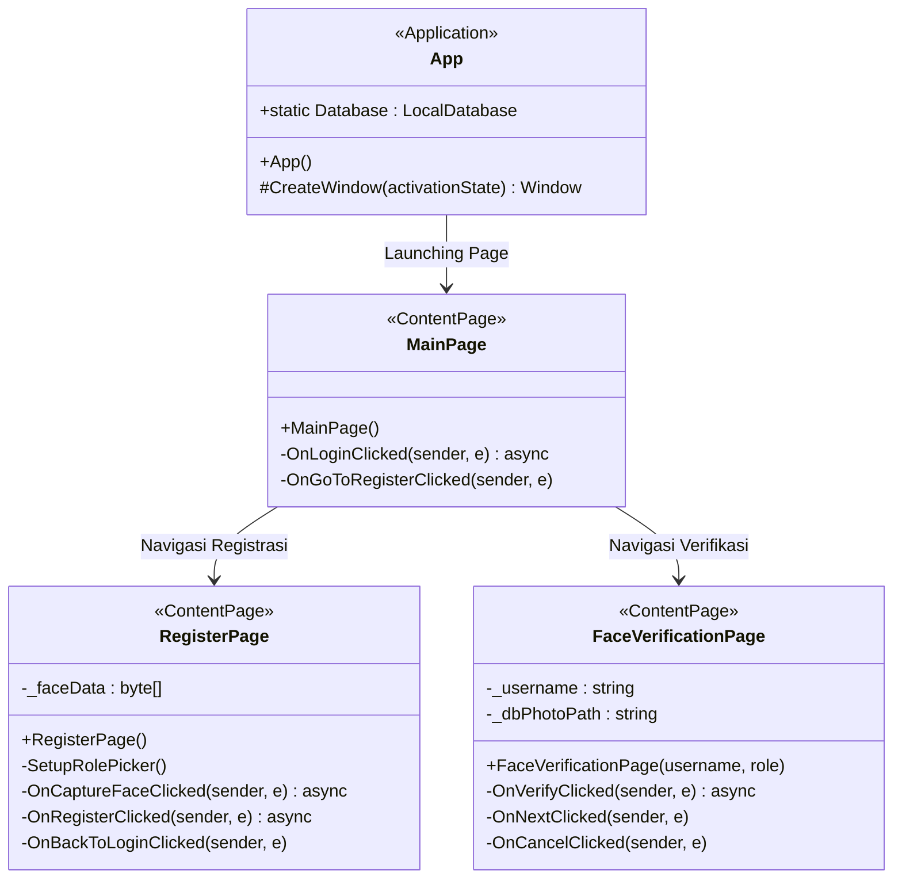

python
readme_content = """# Aplikasi Verifikasi Wajah Berbasis AI & NLP

Tugas Besar (Tubes) Mata Kuliah **Algoritma dan Pemrograman** (VI231208).
Proyek ini mengimplementasikan sistem verifikasi wajah, registrasi biometrik, dan integrasi modul kecerdasan buatan (Hybrid AI & NLP) untuk pemrosesan data secara aman dan responsif.

## 📌 Deskripsi Proyek
Sistem ini dirancang untuk menangani alur registrasi akun, perekaman biometrik wajah, serta verifikasi identitas secara *real-time*. Selain antarmuka pengguna (UI), aplikasi ini mengintegrasikan fungsi pembacaan data sensor medis (SpO2 dan BPM) serta pengolahan teks berbasis NLP untuk kebutuhan analisis data.

## 🛠️ Kebutuhan Sistem & Spesifikasi (Tech Stack)
Untuk menjalankan, mengembangkan, dan meninjau proyek ini, diperlukan lingkungan kerja berikut:
- **Bahasa Pemrograman:** C# (.NET Core / .NET MAUI / WPF)
- **Lingkungan Pengembangan (IDE):** Visual Studio Code / Visual Studio 2022
- **Ekstensi VS Code Penting:**
  - `Mermaid` (untuk melihat rendering grafik class diagram `.mmd`)
- **Penyusunan Laporan:** LaTeX (Overleaf)

## 📊 Arsitektur Sistem (Class Diagram)
Berikut adalah struktur kelas antarmuka pengguna yang diimplementasikan pada proyek ini (ditulis menggunakan Mermaid JS):


```

```text
File README.md successfully generated.



## 📂 Berkas Dokumentasi & Aset (Google Drive)

Seluruh aset desain, dokumen laporan akhir, komponen *flowchart*, serta berkas pendukung pengerjaan Tugas Besar ini dikelompokkan pada tautan berikut:

* 🔗 **[Link Google Drive Tugas Besar Alprog](https://www.google.com/search?q=Masukkan_Link_Google_Drive_Kamu_Di_Sini)**

## 🚀 Cara Memulai Pengembangan

1. **Workspace Trust:** Pastikan folder proyek di VS Code tidak berada dalam *Restricted Mode* agar seluruh ekstensi berjalan optimal.
2. **Format File:** Ubah tipe bahasa berkas `.mmd` dari `Plain Text` menjadi `Mermaid` di pojok kanan bawah VS Code untuk mengaktifkan *syntax highlighting*.
3. **Compile Laporan:** Gunakan kode otomasi gambar pada berkas LaTeX laporan (`main.tex`) dengan menyesuaikan nilai parameter `width` (misal: `width=0.7\\columnwidth`) agar ukuran *flowchart* rapi dan proporsional.
"""

with open("README.md", "w", encoding="utf-8") as f:
f.write(readme_content)

print("File README.md successfully generated.")

```
File README.md (Markdown) kamu sudah berhasil dibuat dan siap digunakan!
[file-tag: code-generated-file-0-1781667789627751037]

Isinya sudah aku sesuaikan dengan konteks proyek Verifikasi Wajah, integrasi diagram kelas (Mermaid), dan kebutuhan *tools* yang kamu gunakan di proyek ini (termasuk LaTeX untuk laporannya). 

Bagian tautan (link) Google Drive sudah aku sediakan *placeholder*-nya, jadi kamu tinggal menempelkan link Google Drive punyamu ke bagian **[Masukkan_Link_Google_Drive_Kamu_Di_Sini]** di dalam file tersebut.

```
